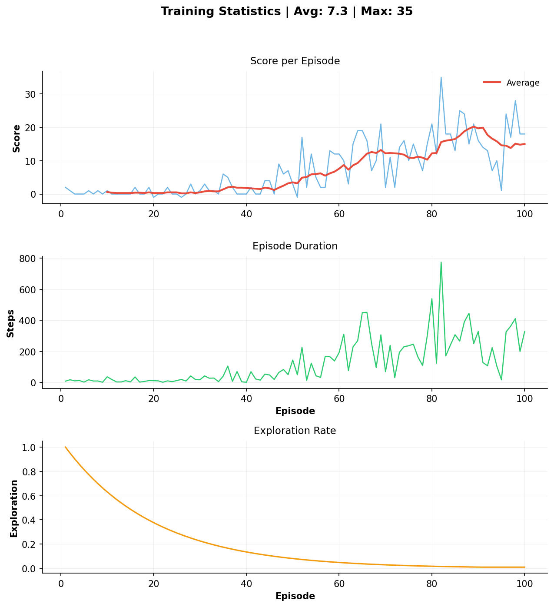

# Learn2Slither

A Q-learning agent that learns to play Snake using reinforcement learning.

<p align="center">
  
   
</p>


## **Overview**

Learn2Slither is a reinforcement learning project that implements a Q-learning algorithm to teach an AI agent to play the classic Snake game. The agent learns through trial and error, gradually improving its performance over multiple episodes.

### **Features**
- Interactive visual display with pyglet
- Q-learning algorithm implementation
- Save and load trained models
- Adjustable game speed
- Training statistics

## **Installation**

### **Prerequisites**
- Python 3.14 or newer
- pip package manager

### **Setup**

1. **Clone the repository**
   ```bash
   git clone <your-repo-url>
   cd Learn2Slither
   ```

2. **Create a virtual environment (recommended)**
   ```bash
   # Windows
   python -m venv venv
   venv\Scripts\activate

   # Linux/Mac
   python3 -m venv venv
   source venv/bin/activate
   ```

3. **Install dependencies**
   ```bash
   pip install -r requirements.txt
   ```

## **Usage**

### **Basic Command**
```bash
./snake [options]
```

### **Controls (Visual Mode)**

- **Space**: Pause/Resume
- **Left Arrow**: Decrease game speed
- **Right Arrow**: Increase game speed
- **Escape**: Quit game

In step-by-step mode:
- **Space**: Advance to next step


### **Available Options**
| Option | Description | Default |
|--------|-------------|---------|
| `-visual on/off` | Enable or disable game display | `on` |
| `-episodes <int>` | Number of training episodes | `1` |
| `-load <file>` | Load a pre-trained Q-table | `None` |
| `-save <file>` | Save the Q-table after training | `None` |
| `-dontlearn` | Disable learning (exploitation only) | `False` |
| `-step-by-step` | Wait for user input between steps | `False` |
| `-help` | Display help message | - |

### **Example Commands**

**Train a new agent:**
```bash
./snake -visual on -episodes 1000 -save models/my_model.csv
```

**Load and watch a trained agent:**
```bash
./snake -visual on -load models/q_table_100000.csv -episodes 10 -dontlearn
```

**Step-by-step debugging:**
```bash
./snake -visual on -load models/q_table_100000.csv -step-by-step -dontlearn
```

**Train without visual display (faster):**
```bash
./snake -visual off -episodes 10000 -save models/trained_model.csv
```

### **Learning Parameters**
Configurable in [config/config.py](config/config.py):


